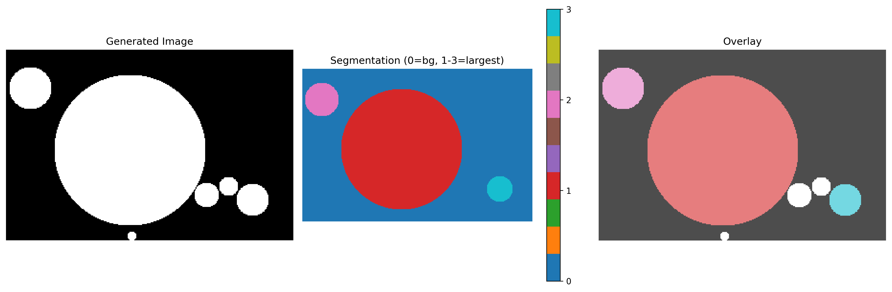
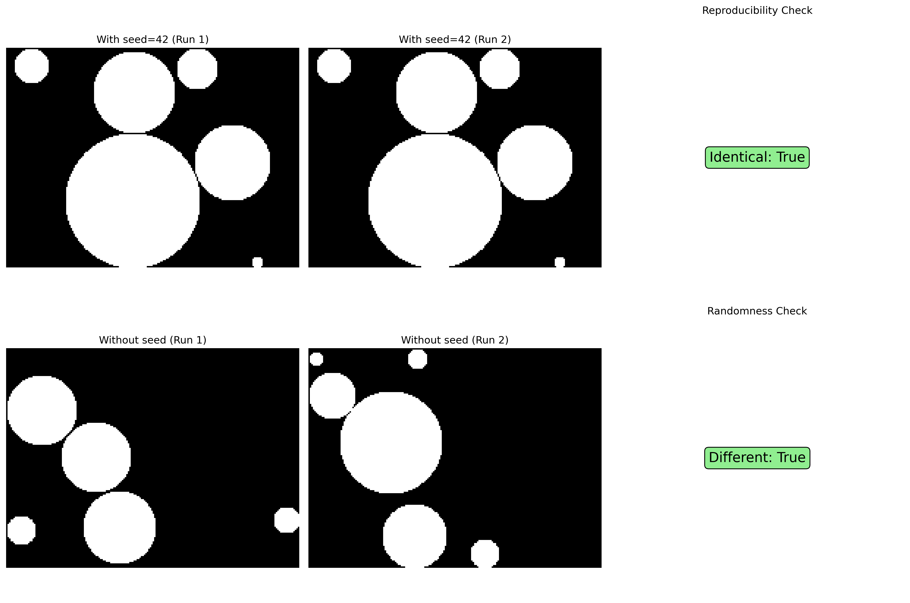

# Segment the largest disks
The goal of this small project is to train a neural network that segments only a selected number of the largest disks in synthetically generated images, while recognizing the order from the largest to the smallest segment.

## Dataset Visualization

The project generates synthetic datasets with non-overlapping disks and segments only the largest ones. Here are some visualizations of the dataset:

### Disk Generation


The algorithm generates non-overlapping disks of various sizes using optimized vectorized rendering.

### Segmentation Example


The dataset labels only the largest disks (1, 2, 3, ...) while keeping smaller disks unlabeled (0 = background).

### Reproducibility


The dataset supports reproducible generation with seeds and proper randomization without seeds.

## Recent Improvements

### Dataset Optimizations ✅
- **Performance**: Optimized disk rendering using vectorized operations (significant speedup)
- **Correctness**: Fixed label generation to properly assign 1-N to largest disks
- **Reproducibility**: Added seed parameter for deterministic dataset generation
- **Code quality**: Removed duplicate operations and improved type consistency

### Logging ✅
- **Confusion matrix metric**: Implemented IoU-based confusion matrix for object detection evaluation
- **Comprehensive testing**: Added 26 tests covering dataset generation, reproducibility, and edge cases

## Tasks to do
The project is under development.
- [x] logging (especially confusion matrix metric) ✅
- [ ] replace mock mse loss with dice loss and cross entropy
- [ ] build docker image with CI pipeline for building the latest version
- [ ] experiment and explore various model architectures

## Usage

Generate visualizations:
```bash
python scripts/plot_circles.py
```

Train the model:
```bash
python -m src.main --config configs/unet.yml
```

Run tests:
```bash
python -m unittest discover tests/ -v
```